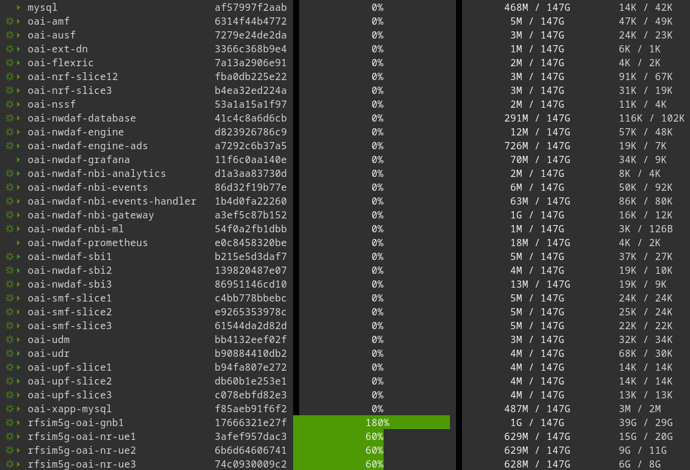
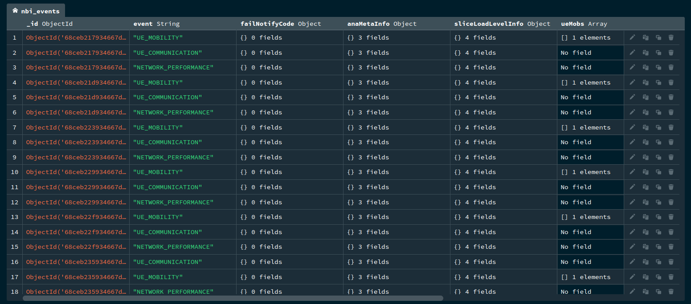
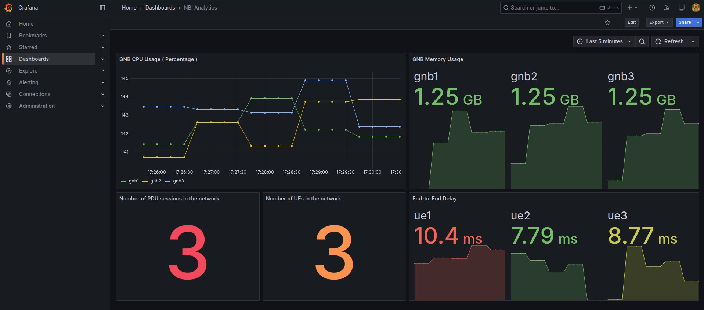

# 6G-TC-NWDAF


[](https://opensource.org/licenses/MIT)


This repository implements a **lightweight Network Data Analytics Function (NWDAF)** designed for integration with the **OAI 5G Core (5GC)** in a **network slicing** environment.

## 📖 Overview

The NWDAF collects **slice-level statistics** (e.g., load, QoS indicators, traffic demand) and shares them with **ML modules** used in the *Traffic Classification (TC)* and *Abnormal Behavior Detection (ABD)* pipelines. This provides **core-side intelligence** that complements RAN-side analytics such as KPIMON and anomaly detection.

## ✨ Key Features

- Upgrade of the upstream [NWDAF](https://gitlab.eurecom.fr/oai/cn5g/oai-cn5g-nwdaf.git) to support **5GC in slicing environments**.  
- Implementation of a new **NWDAF service** (`nbi-events-handler`) for:  
  - Handling network-generated events.  
  - Storing events in a **MongoDB** database.  
  - Collecting additional metrics (e.g., **end-to-end delay**, **resource utilization**).  
  - Exposing metrics to **Prometheus** and visualizing them with **Grafana**.  
- Collection of **slice-specific KPIs** from OAI 5GC.  
- Seamless integration with the ML pipeline for **anomaly detection** and **traffic steering**.  
- **3GPP-compliant design** (TS 29.520).  
- Support for **multi-slice monitoring and analytics**.

## 📂 Repository Contents

- Deployment guides for **Core Network and NWDAF**.
- Source code and documentation for **nbi-events-handler** service.

## 🗂️ Files Description

### 1. `oai-cn5g-nwdaf`
This directory contains the **NWDAF service code** and the **Dockerfile** required to build the base NWDAF images.

### 2. `deployments`
The `deployments` directory is organized into subfolders for **CN**, **RAN**, and **NWDAF** deployments.  
These include:
- **Docker Compose files** for launching the infrastructure.  
- **Configuration files** for services.  
- **Environment variable files**.  

### 3. `nbi-events-handler`
This folder contains the **source code** for the new NWDAF microservice, developed in **Python** and integrated into the NWDAF services.  

Key functions of this microservice:
- Sends event subscription requests to the **NWDAF NBI Events Service**.  
- Continuously collects received event information.  
- Stores collected data in a **MongoDB** database.  
- Exposes metrics to **Prometheus** and visualizes them in **Grafana**.  

#### Notes
- **Note 1:**  
  Inside `deployments/nwdaf/conf/nbi_events_handler_schemas/`, the file `events_schema.json` defines the structure of the events to extract.  
  You can modify this file to:  
  - Change the event types.  
  - Change the Subscription Unique Permanent Identifier (**SUPI**) of the UE.  

- **Note 2:**  
  A Grafana database file is located at:  
  `deployments/nwdaf/conf/oai-nwdaf-grafana/data/`  

  When the NWDAF services are started, this file automatically loads the **dashboards and plots** in Grafana.  
  If you need to load dashboards manually, a JSON export is also available at:  
  `deployments/nwdaf/conf/oai-nwdaf-grafana/grafana.json`

## 🛠️ Prerequisites

Before you begin setting up the environment, make sure you have the following:

- **Docker & Docker Compose** installed and running  
- **Git** installed for cloning repositories  
- Adequate system resources (**CPU, RAM, and Storage**) to run multiple containers

## 🚀 Build Services

Before deployment, each component must be packaged as a **Docker image**.

### Core Network

To deploy the core network components in slicing environments, a set of **prebuilt images** is available on **Docker Hub**.  
These images are already referenced in the provided **Docker Compose** file.

### RAN

To deploy the RAN components (**FlexRIC**, **gNB**, and **UE**), you can use our prebuilt images available on **Docker Hub** under the `ithermai6gtc` namespace.  
For code details and implementation, refer to this [repository](https://github.com/iThermAI/6G-TC-OAI).

### NWDAF

#### 1- NWDAF Base
You can build and pull the base NWDAF images using a provided bash script:
``` Bash
cd deployments/nwdaf
chmod +x build-nwdaf.sh
./build-nwdaf.sh
```

#### 2- NWDAF NBI Events Handler
To build the new NWDAF service (`nbi-events-handler`), run:
``` Bash
cd nbi-events-handler
docker build -t oai-nwdaf-nbi-events-handler:latest .
```

## ▶️ Run Services

To launch the system, execute the following commands **in order**:

### Core Network

Start the **5G Core Network** (slicing environment) using Docker Compose:
``` Bash
cd deployments/slicing
docker compose -f docker-compose-cn.yaml up -d
```

### NWDAF

Run all **NWDAF services**:
``` Bash
cd deployments/nwdaf
docker compose up -d
```

### RAN

Once the **Core Network** and **NWDAF** components are fully loaded, start the RAN components in sequence.

#### 1- gNB
Start the gNB containers:
``` Bash
cd deployments/slicing
docker compose -f docker-compose-ran.yaml up -d oai-gnb{1,2,3}
```

#### 2- UE
After the gNB services are running, launch the UEs sequentially (with a delay between each):
``` Bash
cd deployments/slicing
docker compose -f docker-compose-ran.yaml up -d oai-nr-ue1
sleep 5
docker compose -f docker-compose-ran.yaml up -d oai-nr-ue2
sleep 5
docker compose -f docker-compose-ran.yaml up -d oai-nr-ue3
```

## 📊 Output Samples

This section provides example outputs from a complete run of the testbed.  
The snapshots illustrate the functionality of different components, including **container orchestration**, **persistent metric storage**, and **data visualization**.

### Containers List

The following snapshot shows all active containers deployed in the testbed.

<p align="center">
  
</p>

### MongoDB Metrics

This snapshot shows a sample **MongoDB collection** where event subscription datasets are stored.

<p align="center">
  
</p>

### Grafana

Once the testbed is running, collected metrics can be visualized on the **Grafana dashboard** at: [http://localhost:3000](http://localhost:3000)

The following snapshot illustrates a sample Grafana result.

<p align="center">
  
</p>